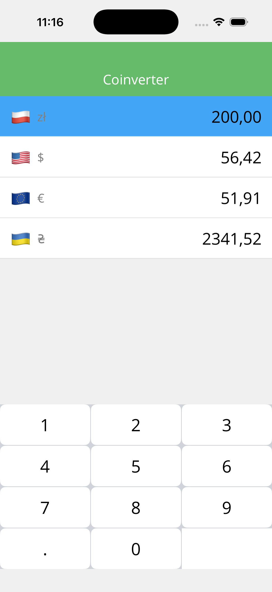
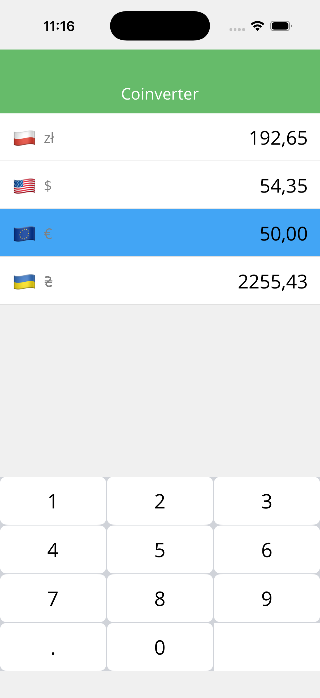

# 💸 CurrenSee


**CurrenSee** is a cross-platform currency converter application built with **.NET MAUI**. It combines real-time currency conversion with an integrated calculator interface, allowing users to perform calculations without switching apps.

The project demonstrates the implementation of the **MVVM pattern**, robust **Data Binding**, and modern **XAML** UI techniques.

---

## 📱 Screenshots

|            Main Screen             |         Calculator Logic          |
|:----------------------------------:|:---------------------------------:|
|  |  |
---

## 🚀 Features

* **Cross-Platform Support:** Runs on Android, iOS, macOS, and Windows.
* **Integrated Keypad:** Custom-built numeric keypad for quick input without the native OS keyboard popping up.
* **Smart UI:**
    * Dynamic background changes using **DataTriggers** for active items.
    * Smooth **CollectionView** implementation for currency lists.
* **MVVM Architecture:** Clean separation of logic and UI using `CommunityToolkit.Mvvm`.

---

## 🛠 Tech Stack & Skills Demonstrated

* **Framework:** .NET MAUI (.NET 9/10)
* **Language:** C#
* **Architecture:** MVVM (Model-View-ViewModel)
* **Libraries:**
    * `CommunityToolkit.Mvvm` (Observables, RelayCommands)
    * `Microsoft.Maui.Controls`
* **UI/UX:**
    * XAML Layouts (Grid, CollectionView)
    * Data Binding & RelativeSource Binding
    * Visual State Manager & Triggers
    * SVG Assets & Custom Fonts

---

## 📂 Project Structure

```text
CurrenSee/
├── MVVM/
│   ├── ViewModels/    # Business logic & Commands
│   ├── Views/         # UI (XAML) pages
│   └── Models/        # Data definitions
├── Resources/         # Images, Fonts, Raw assets
├── App.xaml           # Application entry point
└── MauiProgram.cs     # Dependency Injection setup
```

**Created by: Daniil Zhdanov**